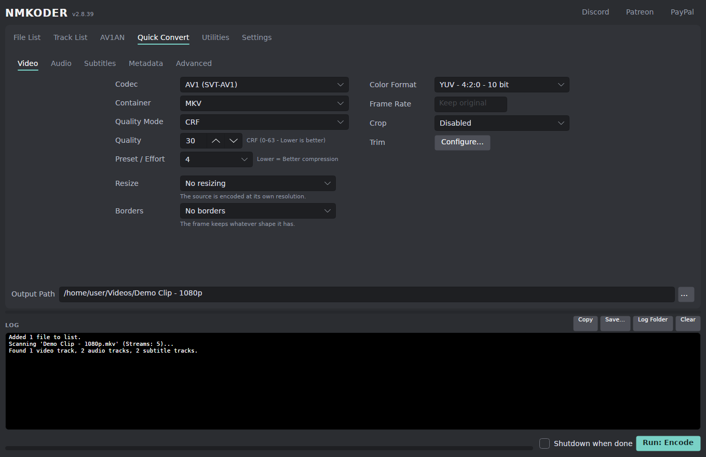
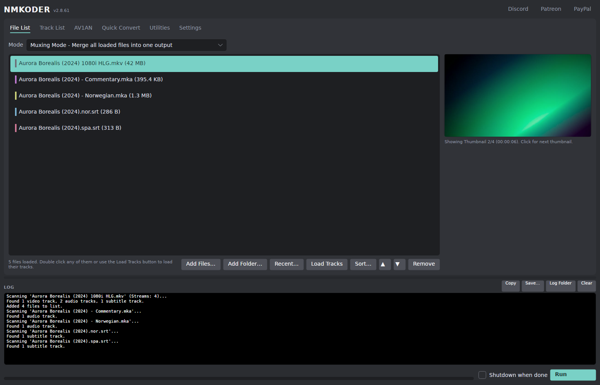
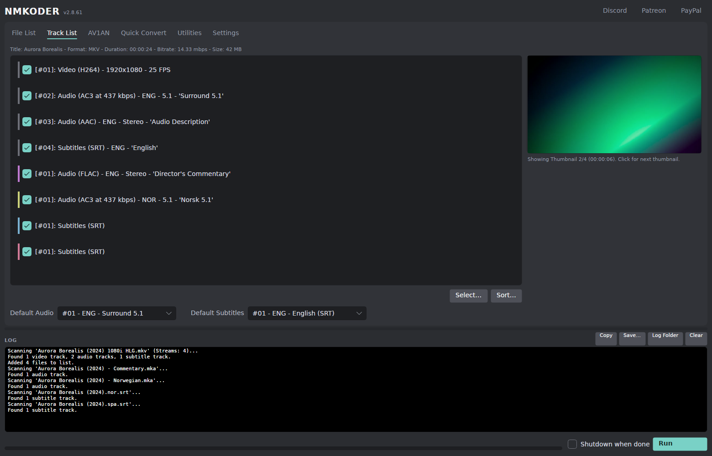
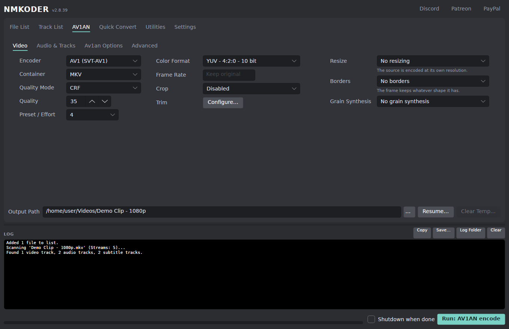
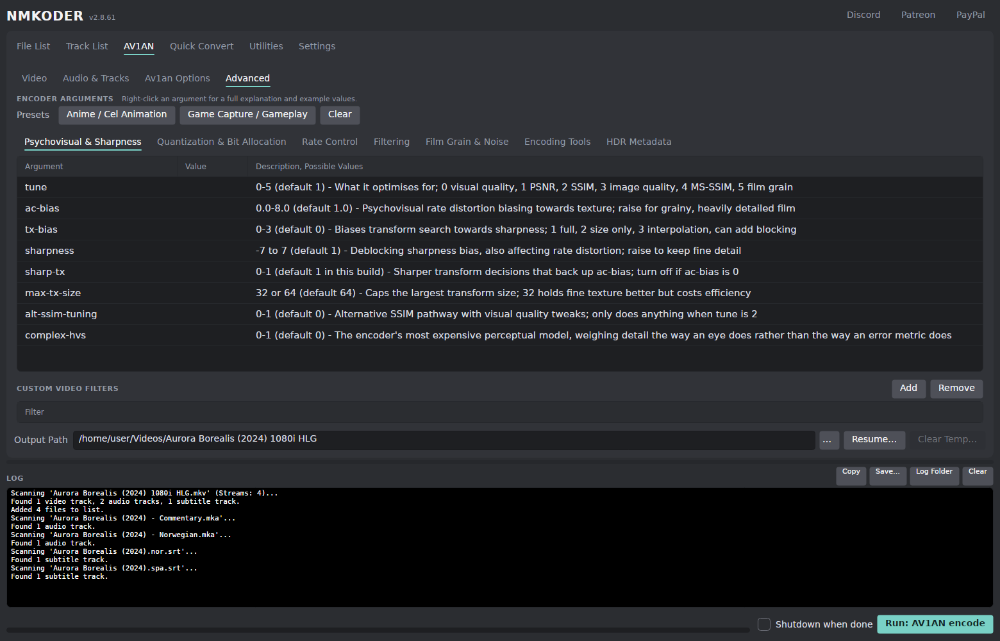
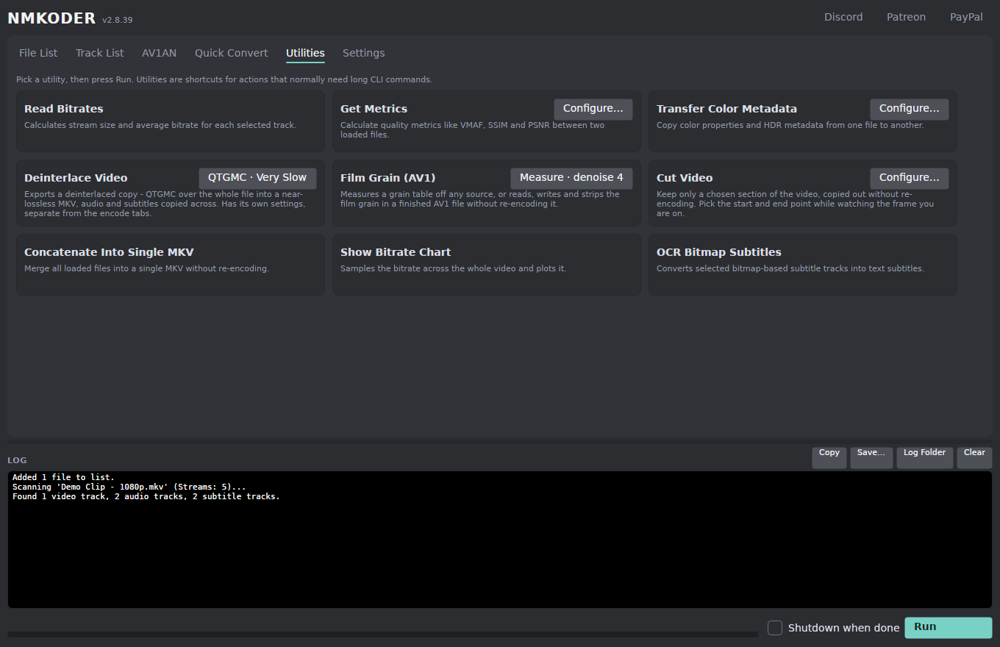
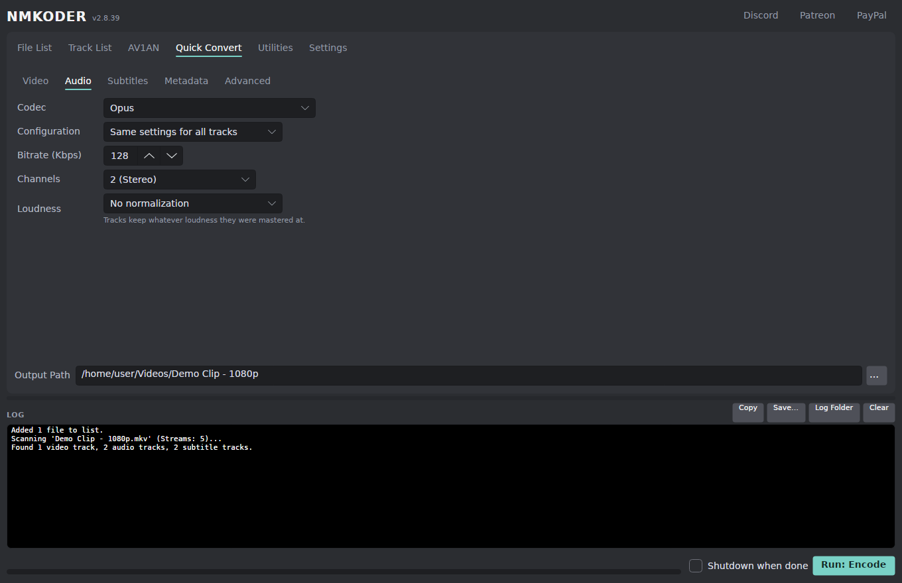

<div align="center">


# Nmkoder

**Video encoding, muxing and analysis — a GUI over FFmpeg, FFprobe and [av1an](https://github.com/rust-av/Av1an).**

Portable and self-contained on Windows, Linux and macOS. Nothing to install.

[](https://github.com/jkkma/nmkoder/releases/latest)
[](https://github.com/jkkma/nmkoder/releases)
[](#download)
[](https://dotnet.microsoft.com/download/dotnet/10.0)
[](https://avaloniaui.net/)
[](LICENSE)

[**Download**](#download) · [Features](#features) · [What's new since the fork](#whats-new-since-the-fork) · [What a release bundles](#what-a-release-bundles) · [Building](#building)



</div>

---

Nmkoder wraps the tools you would otherwise drive by hand. Point it at a file and it reads
every stream out of it; from there you can re-encode, remux, retime, deinterlace, tone-map,
cut, measure or batch the lot, and watch what it is doing in a log you can read.

This is a fork of [n00mkrad/nmkoder](https://github.com/n00mkrad/nmkoder), which was WinForms
on .NET Framework and Windows-only. The UI has been rebuilt, the app ported to three
platforms, and a fair amount added on top — see
[What's new since the fork](#whats-new-since-the-fork).

| Tab | What it is for |
|:--|:--|
| **Quick Convert** | One ffmpeg command, built for you: H.264, H.265, VP9, AV1, GIF and image sequences, per-track audio, subtitle burn-in, loudness normalization. |
| **AV1AN** | Chunked, parallel encoding through av1an, with target-quality modes (VMAF, SSIMULACRA2, Butteraugli, XPSNR) and a full per-encoder argument grid. |
| **Utilities** | The jobs that are not an encode: bitrates, metrics, colour metadata, grain tables, lossless cuts, concatenation, bitrate charts, subtitle OCR. |

## Download

Portable archives for all four platforms are attached to every
[release](https://github.com/jkkma/nmkoder/releases/latest). Unpack and run — each build is
self-contained, so no .NET install is needed.

| Platform | Archive | Size | Bundled into `bin/` |
|:--|:--|--:|:--|
| **Windows** x64 | `Nmkoder-<version>-win-x64.zip` | ~490 MB | Everything: ffmpeg, MKVToolNix, av1an, VapourSynth, the encoders, grav1synth |
| **Linux** x64 | `Nmkoder-<version>-linux-x64.tar.gz` | ~120 MB | ffmpeg, av1an, SVT-AV1, VMAF models, grav1synth |
| **macOS** arm64 | `Nmkoder-<version>-osx-arm64.tar.gz` | ~58 MB | VMAF models, grav1synth |
| **macOS** x64 | `Nmkoder-<version>-osx-x64.tar.gz` | ~61 MB | VMAF models |

The Linux and macOS archives carry less and lean on your package manager; see
[what a release bundles](#what-a-release-bundles) for the whole matrix and the reasons.
Anything you drop into `bin/` yourself takes priority over the same tool on your `PATH`.

<details>
<summary><b>Windows: install with Scoop</b></summary>

On Windows, [Scoop](https://scoop.sh) can install and update it for you. This repository
doubles as a bucket:

```
scoop bucket add nmkoder https://github.com/jkkma/nmkoder
scoop install nmkoder-avalonia
```

The app is `nmkoder-avalonia` rather than `nmkoder` because Scoop's community `extras` bucket
carries the pre-fork WinForms Nmkoder (1.10.0) under that name, and a bare `scoop install nmkoder`
resolves to it. The longer name is unambiguous, and the two can be installed side by side.

`scoop update nmkoder-avalonia` moves to the newest release from then on, and the manifest is
pointed at each one as it is published, so there is no lag. Settings and logs (`data` and `logs`)
are persisted across updates; `bin` is not, being the bundled toolchain that every release
replaces — anything you drop in there yourself belongs in a portable copy rather than a Scoop
install.

</details>

## Screenshots

<table>
<tr>
<td width="50%"><a href="docs/images/file-list.png"></a><br><b>File List</b> — muxing or batch mode, drag and drop, thumbnails you can scrub through.</td>
<td width="50%"><a href="docs/images/track-list.png"></a><br><b>Track List</b> — every stream in the file, with checkboxes, ordering and default-track pickers.</td>
</tr>
<tr>
<td width="50%"><a href="docs/images/av1an.png"></a><br><b>AV1AN</b> — chunked encoding, with the framing and quality controls beside it.</td>
<td width="50%"><a href="docs/images/av1an-advanced.png"></a><br><b>Advanced</b> — the per-encoder argument grid, grouped by category, with content presets.</td>
</tr>
<tr>
<td width="50%"><a href="docs/images/utilities.png"></a><br><b>Utilities</b> — the shortcuts for jobs that would otherwise be long CLI commands.</td>
<td width="50%"><a href="docs/images/quick-convert-audio.png"></a><br><b>Audio</b> — codec, layout and bitrate globally or per track, with EBU R128 loudness normalization.</td>
</tr>
</table>

## Features

Each heading below expands.

<details>
<summary><b>Input</b></summary>

- Supports all formats that ffmpeg can decode
- Either use **"Muxing Mode"** to convert a single file or merge multiple files into one, or
  **"Batch Processing Mode"** to run an action on each file, with a naming template for the outputs
- Supports image sequence inputs (PNG/WEBP/JPEG/BMP) without requiring sequential filenames
  (FPS needs to be set manually)
- Drag and drop anywhere in the window, an "Add Folder" button, and a recent-files list

</details>

<details>
<summary><b>Track List</b></summary>

- View codec, language, title and more (depending on stream type) of the selected media stream
- Enable or disable streams with checkboxes - disabled streams are not included when encoding/muxing
- Re-order streams, and set the default audio and subtitle track

</details>

<details>
<summary><b>Quick Convert (FFmpeg)</b></summary>

- Encode video using ffmpeg and its encoder plugins
- Video Formats: **H.264 (x264 or NVENC), H.265 (x265 or NVENC), VP9, AV1 (SVT-AV1 or AOM)**
- Image Formats: Animated **GIF**, **PNG** Sequence, **JPEG** Sequence
- Audio Formats: **AAC, Opus, Vorbis, E-AC-3, MP3, FLAC**, globally or configured per track
- Text-based Subtitle Formats: Mov_Text for MP4/MOV, SRT for MKV, WebVTT for WEBM
- All media types also have the option to **strip** (remove) or **copy** (mux without re-encoding)
- Set metadata (title and language) for each track, and copy metadata or chapters from any loaded file
- Encoder Options: set quality and speed/effort aka preset, set colour format
- Quality Modes: a **constant quality**, a target **bitrate**, or a target **filesize**
- Video Options: resample the frame rate, **resize** from presets or an exact size, manually or
  **automatically crop** black bars, pad out to a target **aspect ratio**, and **trim** to a section
  picked while watching the frame you are on
- **HDR to SDR tone mapping** for PQ and HLG sources, with the roll-off built around the picture's
  **measured** brightness - on a GPU, libplacebo measures every frame as it goes; without one, a
  sampled scan reads the brightest real pixel first - and the output retagged BT.709
- **Deinterlacing**, its row shown only for files whose fields warrant it - a tape, DVD or camcorder
  capture - and off screen entirely for a modern progressive download. Uses **QTGMC** through
  VapourSynth where it can (bundled on Windows), otherwise ffmpeg's bwdif, and can output one frame
  per field so none of the motion is thrown away
- Audio Options: set quality and channels/layout
- **Loudness normalization** to a standard target (-14 / -16 / -23 LUFS, EBU R128), measured per track
  first and then applied as one flat gain, so the mix keeps its dynamics - a single-pass normalization
  reaches the same number by riding the gain, which lifts quiet passages by however much they were quiet
- Subtitle Options: optionally **burn in** a subtitle track

</details>

<details>
<summary><b>AV1AN Chunked Encoding</b></summary>

- Encode video using [av1an](https://github.com/rust-av/Av1an) and supported encoders
- Video Formats: **AV1 (SVT-AV1 or AOM), H.265 (x265), H.264 (x264), VP9 (VPX)**
- Quality Modes: a **constant quality**, or target a **VMAF**, **SSIMULACRA2**, **Butteraugli** or
  **XPSNR** score (experimental; SSIMULACRA2 needs a VapourSynth metric plugin, bundled on Windows,
  XPSNR is scored by ffmpeg, and Butteraugli currently needs the GPU plugin Vship, which the Windows
  bundle ships and enables per machine - see below)
- Same audio, metadata and framing options as FFmpeg encoding, trim included
- **Deinterlacing** too, its own setting and including **QTGMC**: av1an filters each chunk with
  ffmpeg, which has nowhere to run a VapourSynth script, so picking QTGMC renders the video through it
  once beforehand - into a lossless intermediate that av1an then encodes, optionally at one frame
  per field. Automatic and the ffmpeg deinterlacers run inside av1an as before, at the source frame rate
- **HDR to SDR tone mapping** as well, with the colour the encoder is told about following the
  conversion rather than the source. On a GPU this also renders once in front of av1an - peak
  detection needs one continuous run, where av1an would restart it at every chunk - and when grain
  synthesis needs a denoised copy, both files come out of that one command. Every intermediate in
  the chain is lossless, and scene detection runs alongside these passes rather than after them,
  since none of them changes a frame number
- **Film grain synthesis** for AV1 (the row is disabled for H.264/H.265/VP9, which have none): the
  encoder's own analysis from a strength, a grain table **measured off this source** with grav1synth -
  denoise, diff, encode the clean picture, hand the encoder the table - or a table measured earlier,
  optionally denoising to match it. The readout says whether the picture being coded is clean, which is
  what decides whether any of this saves bitrate or merely adds grain
- **Advanced encoder arguments** in a grid grouped by category, each with a full explanation and
  example values on right-click, plus content presets for anime and for game capture
- Av1an Options: change the splitting method, chunk creation method, number of workers, and more
- Encodes can be paused and resumed live, or stopped entirely and picked up again later from the
  finished chunks

</details>

<details>
<summary><b>Utilities</b></summary>

- Utilities are "shortcuts" for actions that normally require long (and/or multiple) CLI commands
- **Read Bitrates**: calculates stream size and average bitrate for each stream
- **Sample Encodes (CRF ladder)**: answers "what CRF for this source" by trying it, in minutes rather
  than after the eight-hour encode you then regret. A few short sections are cut out from across the
  file, each is encoded at every CRF on the list, and the table reports the video bitrate, the size a
  whole file would come to, that size as a share of the source, and a **VMAF**, **SSIMULACRA2**,
  **Butteraugli** or **XPSNR** score per rung - plus which rung is the highest still worth using
  (VMAF 95, SSIMULACRA2 80, Butteraugli 4 - a distortion, so there lower is better and the pick is the
  highest CRF still *under* the line). SSIMULACRA2 and Butteraugli are scored through VapourSynth, the
  same way the AV1AN tab scores its Target modes (vszip for one, Vship or the julek plugin for the
  other, at the same 203-nit intensity as Target Butteraugli), so they need the Windows bundle - or
  VapourSynth with those plugins installed - and the run says so if it cannot. The sections are cut
  losslessly and each encode is scored against the cut it came from, so the picture measured and the
  picture encoded are the same frames. The Advanced tabs' content presets can be applied to the sample
  encodes too, so the ladder measures the encode actually being planned - SVT-AV1's are written for the
  AV1AN tab's svt-av1-hdr, so only the settings FFmpeg's own SVT-AV1 takes are applied, and the run
  names what did not carry. Its own encoder, preset, colour format, CRF list and sampling, under Configure
- **Get Metrics**: calculate quality metrics like **VMAF**, SSIM, PSNR
- **Transfer Color Metadata**: copy colour properties and HDR metadata from one file to another
  (e.g. from a Bluray remux to an encode)
- **Deinterlace Video**: exports a deinterlaced copy - **QTGMC** over the whole file into a
  near-lossless MKV, with the audio and subtitles copied across. That file is all it produces; nothing
  is loaded back into the file list, and you do not need it in order to encode an interlaced source,
  since both encode tabs deinterlace on their way through. Has its own Deinterlace settings, under
  Configure on its card, separate from either tab's
- **Film Grain (AV1)**: the parts of a grain workflow that are not an encode. **Measure** a grain table
  off any source, whatever its codec - it compares decoded frames - or, on an AV1 file, **extract** the
  table it already carries, **apply** grain to it (from a table, one of grav1synth's film stock presets,
  or photon noise at an ISO), or **remove** every grain header from it. The last three rewrite the AV1
  headers and remux; nothing is re-encoded and the picture is untouched
- **Cut Video**: keep only a chosen section, copied out without re-encoding, with the start and end
  points picked while watching the frame you are on
- **Concatenate Into Single MKV**: merge any amount of any compatible video format into a single MKV
  (e.g. for chunked encoding)
- **Show Bitrate Chart**: samples the bitrate across the entire video and plots it, so you can see
  where bitrate is higher or lower
- **OCR Bitmap Subtitles**: converts selected bitmap-based subtitle tracks into text subtitles

</details>

## What's new since the fork

Each heading below expands.

<details>
<summary><b>The application</b></summary>

- **Ported from WinForms to Avalonia on .NET 10**, with native builds for `win-x64`, `linux-x64`,
  `osx-x64` and `osx-arm64`. Linux and macOS are first-class rather than a WINE suggestion.
- **A dark theme throughout**, rather than the system's default control colours.
- **A release pipeline**: every build is published self-contained and portable, with the external
  tools staged into `bin/` and the job summary listing exactly what each archive shipped.
- **The log is its own panel** - per-line severity colouring, copy, save, clear, and a button that
  opens the session's log folder, which also holds the raw ffmpeg, av1an and mkvmerge logs.
- **The window remembers itself**: size, position, open tab and log height, plus the last browsed
  folders and a recent-files list. **Neither encode tab's settings persist** - both start each session at
  their defaults, because a CRF, a resize or a QTGMC pass left armed from last week is expensive and
  quiet. Quick Convert opens on SVT-AV1 into MKV at CRF 30, preset 4, with audio to Opus at 128 kbps stereo.

</details>

<details>
<summary><b>Deinterlacing</b></summary>

None of this existed before the fork - there was no deinterlacing in the app at all.

- **Sources are checked rather than assumed.** The container's field-order flag is read first - an
  MPEG-2 tape capture or a DV file says what it is - and where it says nothing, a few hundred frames
  are decoded through ffmpeg's `idet`, then measured field-gap by field-gap so that a vertical pan
  over fine detail is not mistaken for combing.
- **The Deinterlace row only appears for files whose fields warrant it**, so a modern download never
  shows the control and a tape capture arrives with the right engine already selected.
- **QTGMC**, the motion-compensated deinterlacer, run through VapourSynth (bundled on Windows) with
  the whole plugin chain it needs, falling back to ffmpeg's bwdif where VapourSynth cannot run it.
  Optionally one frame per field, so none of the motion is thrown away.
- **Both encode tabs deinterlace.** av1an filters each chunk with ffmpeg, which has nowhere to
  evaluate a VapourSynth script, so picking QTGMC there renders the video through it once beforehand
  into a near-lossless intermediate and encodes that.
- **A Deinterlace Video utility** for when the deinterlaced file itself is what you want, with its
  own settings separate from either tab's.

</details>

<details>
<summary><b>HDR tone mapping</b></summary>

- **HDR sources can be converted to SDR**, on both encode tabs. The row only appears for a file whose
  transfer curve says PQ or HLG, and it defaults to doing nothing - the other reason to load an HDR
  file is to re-encode it *as* HDR - so it exists to say the file is HDR and let you choose.
- **The roll-off is built around the picture's measured brightness, not the metadata's claim.** The
  ordinary UHD Blu-ray declares a 4000-nit mastering display and a MaxCLL near the format ceiling
  over frames that top out around 600 nits, and a mapping priced for the metadata renders the whole
  film 30-odd code values darker than a player that measures the signal - which is exactly what mpv
  does, and why the source "looked brighter" there. On a GPU, libplacebo's peak detection measures
  every frame; without one, a sampled scan reads the brightest real pixel off the file and the
  declared value only caps it. The declared metadata cannot simply be trusted *or* passed along:
  measured, FFmpeg's own tone-mapper reads none of it - the same clip with and without MaxCLL and a
  mastering display tone-maps identically - and the widely-copied chain's default clips everything
  above about 374 nits to flat white. The encode log states measured, declared and effective peaks
  per file.
- It runs **before any crop, scale or burnt-in subtitle**, so subtitles are not dragged through a
  gamut conversion written for the picture, and the output is retagged BT.709 with the HDR metadata
  dropped - including on the AV1AN tab, where the encoders are handed colour as numbers and would
  otherwise write SDR pixels into a file tagged HDR.

</details>

<details>
<summary><b>Film grain synthesis</b></summary>

AV1 can describe film grain in a few bytes and have the decoder regenerate it at playback, which on
grainy film is the single largest saving there is - but only where the picture being coded has had the
grain taken out of it first. Before the fork this was one spinner writing one encoder flag.

- **The Grain Synthesis row is now a mode selector**, and that is not cosmetic: SVT-AV1 has *three*
  ways to be asked for grain (`--film-grain`, `--noise`, `--fgs-table`) and takes exactly one of them,
  discarding the others with a warning that goes to a log the app deletes on success. One control that
  writes at most one of them cannot express that collision. What can still collide - a parameter typed
  into the Advanced grid beside it - is reported before the encode, naming which of the two wins.
- **A grain table can be measured off your own source** rather than guessed at by the encoder. The file
  is denoised, [grav1synth](https://github.com/rust-av/grav1synth) measures the difference, the encoder
  is handed the clean picture and the table, and the grain comes back at playback. Measured on a test
  clip at CRF 35: 977 KB encoding the grainy source, 743 KB encoding the denoised one, 759 KB with the
  grain described back into it.
- **The measured table is kept** beside the encode, because it is expensive to make, a few tens of
  kilobytes to store, and describes the *source* rather than that encode - so every later encode of the same
  film can reuse it through the Grain table file mode, denoising to match at the same strength.
- **What it costs is stated before you press Run.** grav1synth's diff runs at about 7.2 megapixels a
  second, single-threaded, so a feature film at 1080p is around eleven hours of measuring on top of a
  lossless intermediate the length of the video. The row names the estimate for the file you have
  loaded rather than letting you find out at hour two.
- **The row is what the encoder does while it encodes.** Grain written into a file that is *already*
  encoded - a film stock preset, photon noise, or a table applied afterwards - is the Film Grain
  utility's job instead, the same division Cut and Deinterlace Video already draw.

</details>

<details>
<summary><b>Using film grain synthesis</b></summary>

Which of these you want depends on what you have and what you are willing to spend.

**Just encode with grain, cheaply** — AV1AN tab → Grain Synthesis → *Encoder analysis*, pick a strength
(10 for lightly grainy digital, 25 for an ordinary film scan) and **tick Denoise**. The encoder does
the whole thing itself: no extra tool, no extra pass. Untick Denoise and you get grain *added* to grain
already in the picture, which costs bitrate rather than saving it - that is what the readout means when
it says the source's own grain is coded too.

**Encode with grain measured from this source** — Grain Synthesis → *Measured from source*. The file is
denoised, grav1synth measures the difference, and av1an encodes the clean picture with the table. More
accurate than the encoder's own guess, and much slower: the readout gives the estimate for the file you
have loaded, and it is hours for a feature. The table is kept beside the output as
`<name>.grain.tbl`.

**Encode the same source again** — Grain Synthesis → *Grain table file*, point it at that kept `.tbl`,
and **tick Denoise at the same strength it was measured with**. This is the measured result without the
measuring, so it costs no more than an ordinary encode. Leave Denoise unticked only if the table is
there to add grain to a source that never had any.

**Work on a file that is already encoded** — Utilities → *Film Grain (AV1)*. Measure a table without
committing to an encode (any codec), extract the table an AV1 file already carries, apply grain to one
from a table, a film stock preset or an ISO, or strip its grain entirely. The last three rewrite the
AV1 headers and remux - nothing is re-encoded and the picture is untouched.

Only *Measured from source* and the utility need grav1synth; *Encoder analysis* works on every AV1
build with nothing installed, and a mode that needs the tool says so by name rather than failing
partway through an encode.

</details>

<details>
<summary><b>Framing: resize, crop, borders and trim</b></summary>

- **Resize is a dropdown with presets** - 2160p through 360p as boxes the picture is fitted inside,
  75/50/25% proportions, and a Custom dialog for exact sizes with letterbox or stretch - replacing
  two free-text width/height boxes. Underneath it, a per-file readout of the frame the encoder will
  actually be handed.
- Anamorphic sources are de-squeezed where the encoder cannot carry the flag, upscaling is stated
  rather than silent, and a target ffmpeg cannot scale to is refused up front instead of failing one
  chunk at a time.
- **Crop keeps the rectangle inside the frame and on the chroma grid**, and a crop too large for the
  file - the usual way a batch goes wrong, four edges outliving the file they were set for - stops
  the run naming the file and the numbers.
- **Borders**: pad out to a target aspect ratio (16:9, 4:3, 1:1, 9:16, 21:9) without scaling. Which
  bars are needed is worked out per file, so a 2.39:1 film and a 4:3 capture both reach 16:9 from one
  dropdown entry. Applied after the crop and the resize, so a scaler never runs over a hard edge.
- **Trim is picked visually.** The in/out dialog shows the frame at the playhead while you choose the
  section, in the shape LosslessCut made familiar, and the same dialog serves Quick Convert, the
  AV1AN tab (which had no trim at all before) and the lossless Cut utility. All three modes - nearest
  keyframe, exact time, frame numbers - land where they say they do, and a section that does not fit
  the file is caught before the encode rather than producing an empty output.

</details>

<details>
<summary><b>The AV1AN tab</b></summary>

- **Target SSIMULACRA2, Target Butteraugli and Target XPSNR** quality modes alongside Target VMAF,
  each checked up front against what the installed av1an and its plugins can actually score.
- **Vship staged per machine** on Windows: the GPU check runs before a metric-targeted encode and
  installs the build this machine passes, so Butteraugli works out of the box and SSIMULACRA2 moves
  to GPU scoring where it can.
- **x264** joins aomenc, SVT-AV1, x265 and vpxenc as an encoder av1an can drive from here.
- **The advanced argument grid is grouped into categories**, and every argument carries a full
  explanation and example values on right-click, rather than a one-line hint in a flat list.
- **Content presets** for the argument grid - Anime / Cel Animation and Game Capture / Gameplay -
  written for the SVT-AV1 PSY line the release bundles. Anything the binary in front of them does not
  support is dropped as the preset is applied, and a parameter typed by hand that the encoder does not
  know stops the run instead of having av1an reject the whole command.
- **Workers and threads-per-worker are derived together** from the core count instead of one being a
  literal, SVT-AV1 runs two workers fewer than the others because it loads a core harder, and
  "Threads per Worker" now actually limits x265 (which has no `--threads`, only `--pools`).
- **Progress is measured from av1an's own temp folder** - chunk counts out of `scenes.json` and
  `done.json` - rather than parsed out of log lines that av1an stopped printing several releases ago.
- Frame-rate resampling no longer kills a run partway through, av1an's log lands in the encode's temp
  folder instead of beside the binary, and a target-quality mode meeting a filter chain says so
  (av1an's probes never see the filters).

</details>

<details>
<summary><b>Quick Convert</b></summary>

- **The command is built in one place, in an order that holds together**: stream maps that know
  whether a filtergraph exists, per-input trim arguments, `-metadata:s:N` indices that count the
  streams which actually reach the output, and a two-pass stats log written into the session folder
  rather than the working directory.
- **Target Filesize divides by the right numbers** - the trimmed duration, and a copied track's own
  bitrate rather than whatever the disabled bitrate spinner happened to hold.
- **Per-track audio configuration** seeds from the channel layout you asked for, and the dropdown it
  overrides is disabled while it governs rather than left looking live.
- **Paths survive the shell and the filtergraph.** Burning in a subtitle track from a path containing
  a space, a colon, an apostrophe, an `=`, a `$` or a backtick works on all three platforms; it
  previously failed on most of them, and on Windows on every path there is.

</details>

<details>
<summary><b>Audio</b></summary>

- **Loudness normalization (EBU R128)** on the Quick Convert tab, to -14, -16 or -23 LUFS. Each track is
  measured in a pass of its own and then encoded with a single flat gain, which is the part that matters:
  ffmpeg's one-pass `loudnorm` hits the same number by riding the gain, and measured on a source whose
  quiet passage sat 26 dB under its loud one it brought the two to within 1.3 dB of each other. The
  channel conversion runs inside the same filter, because the app's own downmix would otherwise happen
  afterwards and leave a 5.1 source 7.7 dB off the target it asked for.

</details>

<details>
<summary><b>Utilities</b></summary>

- **Sample Encodes** - the CRF ladder: short sections from across the source, encoded at several CRFs,
  reported as size-per-minute, a whole-file projection and a **VMAF, SSIMULACRA2, Butteraugli or XPSNR**
  score each. This is the thing a GUI can do that a command line will not: picking the CRF by measuring
  the source rather than by guessing and finding out at the end. The samples are cut losslessly and
  scored against those cuts, so nothing is being compared across a resize or a seek. SSIMULACRA2 and
  Butteraugli are scored through VapourSynth (the AV1AN tab's Target mechanisms - vszip, and Vship or
  julek), so they are Windows-only unless you have VapourSynth and those plugins installed - the run
  refuses with a reason where it cannot compute them. Butteraugli is a distortion on the same 203-nit
  scale as Target Butteraugli: 0 is identical and lower is better. The Advanced tabs' content presets
  can be applied to the samples, so the ladder measures the encode being planned rather than a vanilla
  one - with SVT-AV1's translated as far as FFmpeg's own SVT-AV1 takes them, and the rest named.
- **Cut Video** - keep a chosen section, copied out without re-encoding, picked in the same visual
  dialog as the trim.
- **Deinterlace Video** - a deinterlaced copy into a near-lossless MKV with audio and subtitles
  carried across.
- **OCR Bitmap Subtitles** is now a card on the Utilities tab; the code was there before but nothing
  in the UI reached it.

</details>

<details>
<summary><b>While a job runs</b></summary>

- **Pause actually pauses**, freezing the whole process tree rather than the launcher, and Stop ends
  a run cleanly.
- **Live progress in the footer** with an ETA, whichever tool is running. QTGMC's progress is
  measured against the frame count VapourSynth reports rather than the duration in the container,
  because a tape capture's duration is whatever its capture card claimed - and when a run proves its
  own target wrong, the bar says so instead of sitting at 100%.
- **The OS notifies you when a run ends** and the window is not in the foreground, through
  `notify-send`, `osascript` or the Windows App SDK.
- **What the encode did to the file size** is reported when it finishes.
- **Shutdown when done**, with a 60-second countdown you can call off.
- **Batch mode works**, with per-file status in the file list and output-name templates
  (`{name}`, `{codec}`, `{crf}`, `{index}`, `{date}` and more) - a batch overwrites the output box
  per file, so the template is the only say you get in what twelve files are called.

</details>

<details>
<summary><b>Fixes worth naming</b></summary>

- The Metrics utility had been passing the VMAF model file as libvmaf's *log path*, which scored
  every run against the built-in default and overwrote the bundled model with an XML log - which
  av1an was then pointed at. Models are selected by version now, and no path goes into that filter.
- The bitrate readout reported `Size: 0B (0.0%)` for every stream, ffmpeg having renamed the unit in
  its stats line from `kB` to `KiB`.
- Colour metadata is read using the names ffprobe actually prints and re-spelled per encoder, aomenc
  refusing a name it does not know by encoding nothing at all.
- A missing mkvmerge - routine on Linux and macOS - is detected before it is needed, rather than
  showing up as an av1an encode that quietly finished without audio or a concat that failed naming a
  temp path.
- Animated GIF could not be produced at all unless some other filter happened to be configured.

</details>

## Compatibility

- Windows 10/11 64-bit is the primary target. Since the move from WinForms to Avalonia the app also
  builds and runs natively on Linux and macOS.
- Released archives are self-contained: no .NET install is required. Building framework-dependent
  yourself needs the [.NET 10 runtime](https://dotnet.microsoft.com/download/dotnet/10.0).
- `ffmpeg`, `ffprobe`, `mkvmerge` and `av1an` are looked up in the `bin` folder next to the
  executable first, then on `PATH`.

## What a release bundles

Portable builds are produced by `.github/workflows/release.yml`. Push a `v*` tag to publish a
release, or run the workflow manually to get a draft. `.github/scripts/bundle-tools.sh` stages the
external tools into `bin/`:

| | ffmpeg / ffprobe | MKVToolNix | av1an | VapourSynth | SVT-AV1 | aomenc, x264, x265 | vpxenc | VMAF models | grav1synth |
|---|---|---|---|---|---|---|---|---|---|
| win-x64 | bundled | bundled | bundled | bundled | bundled | bundled | bundled | bundled | built from source |
| linux-x64 | bundled | use package manager | bundled | use package manager | bundled | use package manager | use package manager | bundled | built from source |
| osx-x64 / osx-arm64 | `brew install ffmpeg` | `brew install mkvtoolnix` | `cargo install av1an` | `brew install vapoursynth` | build from source, see below | `brew install aom x264 x265` | `brew install libvpx` | bundled | arm64 only, see below |

Tool downloads are best-effort: an unreachable upstream is reported and skipped rather than failing
the release, and the workflow's job summary lists exactly what each build shipped.

<details>
<summary><b>grav1synth is compiled, not downloaded</b></summary>

[grav1synth](https://github.com/rust-av/grav1synth) is what reads and writes the film grain
description inside an AV1 bitstream, and the Grain Synthesis row needs it for anything but the
encoder's own analysis. It has never cut a release - there is not one tag on the repository - so
there is no binary to fetch and the release workflow builds it from a pinned commit, which is the
only tool here that needs a compiler on the runner.

Two consequences worth knowing:

- **osx-x64 does not get it.** Compiling produces a binary for the host, and GitHub's macOS runners
  are arm64, so an osx-x64 build would ship an arm64 binary inside an Intel archive. The bundler
  skips it and says so rather than doing that. `cargo install --git https://github.com/rust-av/grav1synth`
  puts one on your `PATH` if you want it there.
- **The Windows archive carries FFmpeg's shared libraries because of it**, about 168 MB uncompressed.
  The only FFmpeg build that ships headers and import libraries is the shared one, so a Windows
  grav1synth links against DLLs and cannot start without them beside it. They are copied in before the
  build is smoke-tested, and removed again with it if it still will not run.

Without it, everything else still works: the encoder's own grain synthesis needs no tool at all, and
the modes and the utility that do name the missing binary and why rather than failing mid-encode.

</details>

<details>
<summary><b>SVT-AV1 comes from the PSY line</b></summary>

Nmkoder bundles the [svt-av1-hdr](https://github.com/juliobbv-p/svt-av1-hdr) build, which continues
the SVT-AV1-PSY line, and the AV1AN tab's content presets are written for that line's parameters and
defaults. Mainline SVT-AV1 - which is what Homebrew's `svt-av1` is - has absorbed much of the PSY
surface by now, but not all of it: the noise family, `fgs-table`, `tx-bias` and
`noise-adaptive-filtering` are still the fork's alone, and a mainline binary rejects a parameter it
does not know outright rather than ignoring it - so Nmkoder asks the binary and drops what it lacks,
saying so in the log. What no check can put back is the defaults: features mainline accepts it keeps
off (`enable-qm`, variance boost) where the PSY line has them on, so the same command means less
there. On macOS, build svt-av1-hdr from source and put `SvtAv1EncApp` on your `PATH` to get the
presets as intended. There is deliberately no mainline fallback: a substituted binary under the same
filename is worse than a visible skip.

</details>

<details>
<summary><b>VapourSynth, and what needs it</b></summary>

The portable VapourSynth build is Windows-only, and it is what QTGMC deinterlacing and the
VapourSynth chunk methods run on. On Linux and macOS, install VapourSynth through your package
manager; without it, QTGMC falls back to bwdif and says so.

Target SSIMULACRA2 scores its probes through the
[vszip](https://github.com/dnjulek/vapoursynth-zip) VapourSynth plugin (or the GPU-accelerated
[vship](https://github.com/Line-fr/Vship)), which has to be installed into VapourSynth's plugin
directory by hand on Linux and macOS - without it, that quality mode fails once av1an starts probing.
Target Butteraugli needs vship specifically, for the reason below. Target XPSNR needs no plugin:
av1an scores it with ffmpeg's `xpsnr` filter, present in the bundled ffmpeg and in any FFmpeg from
7.1 on.

**The caveat on Butteraugli:** every av1an release to date calls the CPU scoring plugin
([julek](https://github.com/dnjulek/vapoursynth-julek-plugin)) by the wrong function name
(`butteraugli` where the plugin registers `Butteraugli`), so that path fails at probe time no matter
what is installed. Until av1an fixes the invoke, Target Butteraugli works only through
[vship](https://github.com/Line-fr/Vship). The Windows bundle therefore ships both Vship builds
parked in `vsynth/vship`, outside the autoload folder, and before a metric-targeted encode the app
runs Vship's own GPU check and stages the build this machine passes into `vs-plugins` - so
Butteraugli works out of the box on a capable NVIDIA or AMD GPU, and SSIMULACRA2 moves to GPU scoring
on those same machines, since av1an prefers Vship wherever it sees it. A machine no build passes on is
stopped up front with the working alternatives named. The staged copy carries nmkoder's own file name
(`nmkoder-vship_*.dll`), so a Vship you install into `vs-plugins` yourself - under upstream's names or
any other - is recognised as yours: the app withdraws its own copy and never touches your file. Where
there is no bundled plugin folder to manage (Linux/macOS), the app only warns.

</details>

<details>
<summary><b>The staged layout</b></summary>

The AV1AN tab's toolchain is staged in the layout the app runs it from:

```
bin/av1an/av1an[.exe]        av1an itself
bin/av1an/vsynth/            VapourSynth + embedded Python (VSPipe)
bin/av1an/vsynth/vs-plugins/ BestSource, L-SMASH-Works and FFMS2, for the matching chunk methods,
                             vszip, which scores Target SSIMULACRA2 probes, julek, staged
                             for Butteraugli until av1an can call it (see the caveat above),
                             and mvtools, znedi3, EEDI3, fmtconv, RemoveGrain, MiscFilters,
                             TemporalSoften2 and FFT3DFilter, which are what QTGMC deinterlacing
                             is made of (FFT3DFilter only for its two denoising presets)
bin/av1an/vsynth/vship/      Vship's NVIDIA + AMD builds, parked; the app stages the one this
                             machine's GPU passes into vs-plugins, and unstages both when none does
bin/av1an/enc/               SvtAv1EncApp, aomenc, vpxenc, x264 and x265
```

grav1synth is not part of that tree - it sits in `bin/` beside ffmpeg and mkvmerge, which is where the
app looks for it, with FFmpeg's shared libraries next to it on Windows.

`vsynth` and `enc` are prepended to av1an's `PATH`, so nothing needs installing system-wide.

DGDecNV is the one chunk method left uncovered - it needs a licensed DGDecNV install.

</details>

<details>
<summary><b>Overriding the sources</b></summary>

Binaries are resolved from each project's releases at build time, except SvtAv1EncApp, aomenc, x264
and x265, which upstream does not publish for Windows and so come from MSYS2's mingw64 packages.
Override the sources with the `AV1AN_REPO`, `SVTAV1_REPOS`, `VAPOURSYNTH_REPO`, `LSMASH_REPO`,
`FFMS2_REPO`, `BESTSOURCE_REPO`, `VSZIP_REPO`, `VSZIP_TAG`, `VSJULEK_REPO`, `VSJULEK_TAG`,
`VSHIP_REPO`, `VSHIP_TAG`, `PYTHON_EMBED_VERSIONS`, `MSYS2_ENCODERS`, `MSYS2_ROOT`, `GH_RELEASE_SCAN`
and `MKVTOOLNIX_VERSION` environment variables.

</details>

<details>
<summary><b>vpxenc has no upstream Windows build</b></summary>

No project publishes a prebuilt Windows vpxenc: the WebM project ships source only,
ShiftMediaProject builds the library rather than the CLI, and MSYS2's `libvpx` package leaves the
encoder out. Windows builds therefore take a community build of libvpx - shared in the AV1 community
Discord, and inspected before it was used here.

It is fetched from a **release asset of this repository** (`VPXENC_REPO`, defaulting to the repo being
built), pinned by SHA1 through `VPXENC_ASSET_SHA1` and looked for on a named tag through
`VPXENC_ASSET_TAG`, since an asset attached once slides out of the most recent handful of releases
after a while and would otherwise stop being found. Replacing the asset means updating that hash;
anything else is rejected rather than shipped.

The fallback is <https://jeremylee.sh/bins/vpx.7z>, the build the av1an ecosystem uses. That is one
person's server with no signed provenance and a certificate that has expired before now - downloads
are made with certificate verification on, so if it does not validate when a release is built, vpxenc
is reported as a failed download and skipped rather than fetched insecurely. `VPXENC_SHA1` pins that
route too, left unset by default because the build rolls forward and a fixed hash would reject every
future one.

Either way nothing is trusted just because it downloaded: the bundler verifies the staged file really
is a Windows executable, and `bin/THIRD-PARTY.txt` records which source it came from and that it is a
community build rather than an official one.

Point `VPXENC_URL` at a different build (a bare `.exe` or an archive containing one) to override the
fallback, or set it empty (`VPXENC_URL=`) to skip that route entirely. Without vpxenc the AV1AN tab's
VP9 entry has no encoder behind it; the Quick Convert tab's VP9 support goes through the bundled
ffmpeg and is unaffected either way.

</details>

<details>
<summary><b>Data files</b></summary>

`bin/iso639.csv`, the language table that names audio and subtitle tracks, is not downloaded - it
lives in `Nmkoder/BinFiles` and every build copies it into `bin`. Regenerate it with
`.github/scripts/gen-iso639.py` when the ISO registers move. The same folder carries the AV1AN tab's
per-encoder argument lists (`BinFiles/encoderArgs`, one folder per tool).

</details>

## Building

```
dotnet build Nmkoder.sln -c Release
```

To produce a self-contained, single-file build for a given platform:

```
dotnet publish Nmkoder/Nmkoder.csproj -c Release -r win-x64   --self-contained -p:PublishSingleFile=true
dotnet publish Nmkoder/Nmkoder.csproj -c Release -r linux-x64 --self-contained -p:PublishSingleFile=true
dotnet publish Nmkoder/Nmkoder.csproj -c Release -r osx-arm64 --self-contained -p:PublishSingleFile=true
```

The project multi-targets `net10.0` everywhere plus `net10.0-windows10.0.19041.0` when the host is
Windows; that second target framework is the one carrying the Windows App SDK, used for notifications.

## Credits and licence

Nmkoder was written by [N00MKRAD](https://github.com/n00mkrad); this is a fork of
[n00mkrad/nmkoder](https://github.com/n00mkrad/nmkoder). Licensed under the GPL-3.0 - see
[LICENSE](LICENSE). The bundled third-party tools keep their own licences, recorded in
`bin/THIRD-PARTY.txt` in every release archive.
